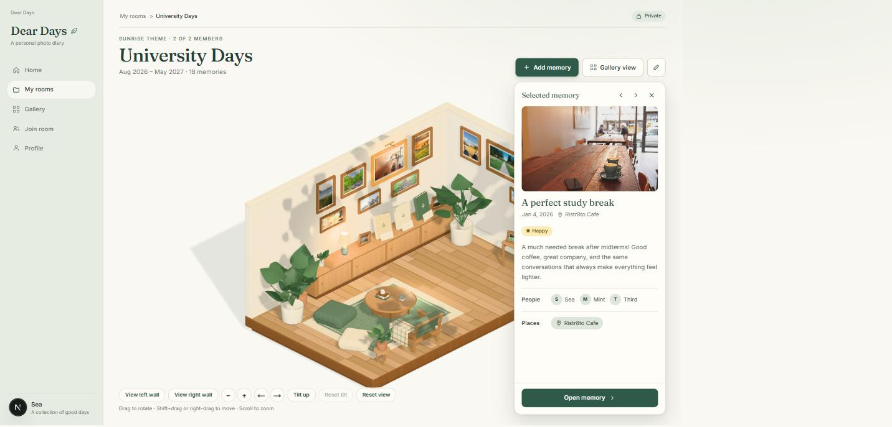

# Dear Days

<p align="center">
  <strong>Little moments, kept forever.</strong><br />
  ไดอารี่ภาพส่วนตัวสำหรับเก็บและแบ่งปันความทรงจำกับคนสำคัญในพื้นที่ของเราสองคน
</p>

<p align="center">
  <a href="https://github.com/CutieCat8/Dear-Days/actions/workflows/ci.yml">
    
  </a>
</p>



## เกี่ยวกับโปรเจกต์

Dear Days เป็นเว็บแอปไดอารี่ส่วนตัวที่จัดความทรงจำเป็น “ห้อง” แต่ละห้องมีเจ้าของและสมาชิกที่เชิญได้อีก 1 คน ผู้ใช้บันทึกเรื่องราว วันที่ mood รูปภาพ บุคคล และสถานที่ แล้วกลับมาดูได้ทั้งแบบ Gallery และห้องพิพิธภัณฑ์ 3D

โปรเจกต์เน้นความเป็นส่วนตัวเป็นหลัก: ข้อมูลห้องและรูปภาพเข้าถึงได้เฉพาะสมาชิก ห้องใช้ Row Level Security และรูปถูกเก็บใน private Storage bucket พร้อม signed URL ชั่วคราว

## ฟีเจอร์หลัก

- สมัครสมาชิก เข้าสู่ระบบ และจัดการ session ด้วย Supabase Auth
- สร้างและแก้ไขห้องส่วนตัว พร้อมธีมและคำอธิบาย
- เชิญสมาชิกอีก 1 คนด้วย invite code/link และป้องกันห้องเกิน 2 คน
- สร้าง แก้ไข อ่าน และลบความทรงจำ
- mood เป็น optional: `awful`, `stressed`, `sad`, `relaxed`, `happy`, `excited` หรือไม่เลือก
- แนบรูปได้สูงสุด 8 รูป พร้อมเรียงลำดับและเลือกภาพปก; ไดอารี่ข้อความล้วนก็ได้
- tags แยก `person` และ `place` ภายในแต่ละห้อง
- Gallery สำหรับค้นหา กรอง และดูความทรงจำตามปฏิทิน
- ห้องพิพิธภัณฑ์ 3D บน desktop และ card layout ที่อ่านง่ายบน mobile
- หนังสือ 3 เล่มบนตู้ในห้อง 3D (Monthly, Yearbook, Highlights) เปิดอ่านแบบ flipbook ได้; Highlights คือความทรงจำที่ผู้ใช้กดดาวเอง (เป็นของแต่ละคน)
- รองรับ keyboard interaction, loading, empty, error และ not-found states
- สลับระหว่าง mock data แบบ read-only กับ Supabase data จริงได้อย่างชัดเจน

## สถานะปัจจุบัน

| ส่วน | สถานะ |
| --- | --- |
| UI และ responsive routes หลัก | พร้อมใช้งานกับ mock fixtures |
| Auth, Room, Memory, Media, Tags data layer | เขียนแล้วและทดสอบกับ Supabase local stack |
| Migrations, RLS, RPC และ private Storage | ใช้กับ local stack แล้ว; migrations ถูก apply ไป hosted project แล้ว |
| Hosted single-owner checks | ตรวจ profile, create/edit/delete room และ permission พื้นฐานแล้ว |
| Hosted multi-user/browser flow | ยังต้องตรวจด้วยบัญชี owner/member/outsider จริง |
| Email confirmation/SMTP | ยังต้องตรวจ end-to-end และตั้ง SMTP สำหรับการใช้งานจริง |
| Production deployment | ยังไม่ deploy; ซีเป็นผู้ดูแล release และ production credentials |

รายละเอียดการตรวจ Supabase ล่าสุดอยู่ใน [Supabase handoff](docs/SUPABASE-HANDOFF.md)

## Tech stack

| Layer | Technology |
| --- | --- |
| Web | Next.js App Router, React, TypeScript strict |
| Styling | Tailwind CSS, shared design tokens, Motion |
| Forms/validation | React Hook Form, Zod |
| Backend | Supabase Auth, Postgres, RPC, Row Level Security |
| Media | Supabase private Storage, signed URLs |
| 3D | Three.js, React Three Fiber, Drei |
| Quality | ESLint, TypeScript, Node test runner, GitHub Actions |

## เริ่มต้นใช้งาน

### Requirements

- Node.js `>= 20.9.0`
- npm
- Docker เฉพาะเมื่อต้องใช้ Supabase local stack หรือรัน database tests

### Mock mode — เริ่มเร็วที่สุด

ไม่ต้องใช้ Supabase และไม่มีข้อมูลถูกบันทึก:

```bash
npm install
npm run dev
```

เปิด [http://localhost:3000](http://localhost:3000) เมื่อไม่มี Supabase environment variables แอปจะเลือก mock mode โดยอัตโนมัติ

หากมี `.env.local` อยู่แล้ว ให้กำหนดโหมดอย่างชัดเจน:

```env
NEXT_PUBLIC_DATA_MODE=mock
```

### Supabase mode

คัดลอก environment template:

```powershell
Copy-Item .env.example .env.local
```

หรือบน macOS/Linux:

```bash
cp .env.example .env.local
```

แก้ `.env.local` ด้วย public values ของ project:

```env
NEXT_PUBLIC_DATA_MODE=supabase
NEXT_PUBLIC_SUPABASE_URL=https://your-project-ref.supabase.co
NEXT_PUBLIC_SUPABASE_ANON_KEY=your-anon-or-publishable-key
```

จากนั้นรัน:

```bash
npm run dev
```

เมื่อเลือก `supabase` แต่ URL หรือ key ไม่ครบ แอปจะหยุดด้วย error และจะไม่ fallback ไป mock mode แบบเงียบ ๆ

> ห้ามใส่ service-role key, database password หรือ secret ใด ๆ ในตัวแปร `NEXT_PUBLIC_*`, `.env.example` หรือ Git

วิธีตั้ง local/hosted Supabase, apply migrations และตั้ง Auth redirect URL ดูที่ [Database setup](docs/DATABASE-SETUP.md)

## คำสั่งที่ใช้บ่อย

| Command | หน้าที่ |
| --- | --- |
| `npm run dev` | เปิด development server |
| `npm run build` | สร้าง production build |
| `npm run start` | เปิด production server จาก build |
| `npm run lint` | ตรวจ ESLint |
| `npm run typecheck` | ตรวจ TypeScript โดยไม่ emit |
| `npm run check:fixtures` | ตรวจ shared fixtures และกรณีข้อมูลสำคัญ |
| `npm run test:unit` | รัน unit tests ของ data layer |
| `npm run test:db` | รัน migrations และ RLS/constraint tests บน Postgres 15 ใน Docker |
| `npm run test:integration` | รัน owner/member/outsider flows กับ Supabase local stack |
| `npm run gen:types` | generate Supabase database types จาก local schema |

ก่อนเปิด Pull Request อย่างน้อยให้รัน:

```bash
npm run lint
npm run typecheck
npm run check:fixtures
npm run test:unit
npm run build
```

`test:db` และ `test:integration` ต้องมี environment ตาม [Database setup](docs/DATABASE-SETUP.md)

## Routes หลัก

| Route | หน้าที่ |
| --- | --- |
| `/sign-up`, `/sign-in` | สมัครและเข้าสู่ระบบ |
| `/` | Dashboard และห้องของผู้ใช้ |
| `/profile` | โปรไฟล์และสถิติ |
| `/rooms` | รายการห้อง |
| `/rooms/new` | สร้างห้อง |
| `/rooms/join` | เข้าร่วมห้องด้วย invite code/link |
| `/rooms/[roomId]` | ห้องพิพิธภัณฑ์ 3D / mobile cards |
| `/rooms/[roomId]/edit` | ตั้งค่าห้องและจัดการสมาชิก |
| `/rooms/[roomId]/gallery` | ค้นหาและกรองความทรงจำ |
| `/rooms/[roomId]/memories/new` | สร้างความทรงจำ |
| `/rooms/[roomId]/memories/[memoryId]` | อ่านรายละเอียดความทรงจำ |
| `/rooms/[roomId]/memories/[memoryId]/edit` | แก้ไขความทรงจำ |

## Architecture

```text
src/app/                     App Router, layouts และ route states
src/components/features/     UI แยกตาม feature
src/components/layout/       app shell และ navigation
src/components/shared/       reusable components ที่ไม่ผูก data source
src/lib/contracts/           Zod schemas, types, interfaces และ fixtures
src/lib/data/                mock/Supabase adapters และ data boundary
src/lib/supabase/            browser/server clients, proxy และ generated types
supabase/migrations/         schema, constraints, RPC, RLS และ Storage policies
supabase/tests/              database permission/constraint tests
tests/                       unit tests
scripts/                     fixture, database และ integration tooling
docs/                        contracts, setup, UI และ handoff documents
```

Data flow หลัก:

```text
Route / Feature UI
        ↓
DearDaysDataSource contract
        ↓
MockDataSource หรือ SupabaseDataSource
        ↓
Supabase Auth / Postgres / private Storage
```

Presentational components ต้องไม่ query Supabase โดยตรง การเปลี่ยน entity field ต้องแก้ Zod schema, derived types, fixtures, database migration และ contracts ให้สอดคล้องกัน

## Privacy และ security

- ทุก domain table เปิด Row Level Security
- สมาชิกอ่านข้อมูลได้เฉพาะห้องที่ตนอยู่
- เจ้าของเท่านั้นที่แก้ข้อมูลห้องและจัดการสมาชิก
- ผู้เขียนเท่านั้นที่แก้หรือลบความทรงจำของตนเอง
- ห้องจำกัดสมาชิกสูงสุด 2 คนด้วย database constraint/transaction ไม่พึ่ง UI อย่างเดียว
- bucket `memory-media` เป็น private; database เก็บเฉพาะ storage path
- รูปถูกเปิดผ่าน signed URL อายุจำกัด
- `author_id` และสิทธิ์ผู้ใช้มาจาก authenticated session ไม่เชื่อค่าจาก browser
- GitHub Actions ใช้ mock mode และไม่มี production secrets

ข้อจำกัดด้านความปลอดภัยและ checklist ก่อนขึ้น hosted project ดูใน [Database setup](docs/DATABASE-SETUP.md)

## ทีมและ ownership

| คน | ความรับผิดชอบ |
| --- | --- |
| จิรวัฒน์ | Auth/Profile และ application integration ของ Memory, Media และ Tags |
| สิรวิชญ์ | Room/Membership/Invite, Home/Gallery/Museum integration และ release candidate |
| ซี | Project ownership, Database, RLS/Storage, Privacy, final UI review และ production deployment |

การแบ่งงานล่าสุดและ acceptance criteria อยู่ใน [Revised task breakdown](docs/REVISED-TASK-BREAKDOWN.md)

## เอกสารสำคัญ

- [Project proposal](Dear-Days-Project-Proposal.md) — ขอบเขตและแนวคิดผลิตภัณฑ์
- [Revised task breakdown](docs/REVISED-TASK-BREAKDOWN.md) — งานคงเหลือและผู้รับผิดชอบล่าสุด
- [Contracts](docs/CONTRACTS.md) — routes, entity types, errors, filters และ media mutation
- [Database setup](docs/DATABASE-SETUP.md) — local/hosted Supabase และ rollout checklist
- [Supabase handoff](docs/SUPABASE-HANDOFF.md) — สถานะ integration และหลักฐานการตรวจล่าสุด
- [UI guide](docs/UI-GUIDE.md) — design tokens, components และ responsive rules
- [3D room handoff](docs/ROOM-3D-HANDOFF.md) — architecture, controls, QA และ backlog ของ Museum room

## Workflow สำหรับทีม

1. เริ่ม branch จาก commit ล่าสุดของ `main`
2. หนึ่ง task ต่อหนึ่ง commit ที่อธิบายได้
3. ห้ามเปลี่ยน contract หรือ database schema โดยไม่แจ้งเจ้าของส่วนที่ได้รับผลกระทบ
4. Database change ทุกครั้งต้องมี migration; ห้ามแก้ hosted schema ผ่าน Dashboard แล้วไม่บันทึกใน repo
5. เปิด Pull Request พร้อมผล checks และ known limitations
6. ซีเป็นผู้ถือ production credentials และเป็นผู้อนุมัติ deployment

โปรเจกต์นี้เป็นผลงาน MVP ของทีม **BlackJackie**
